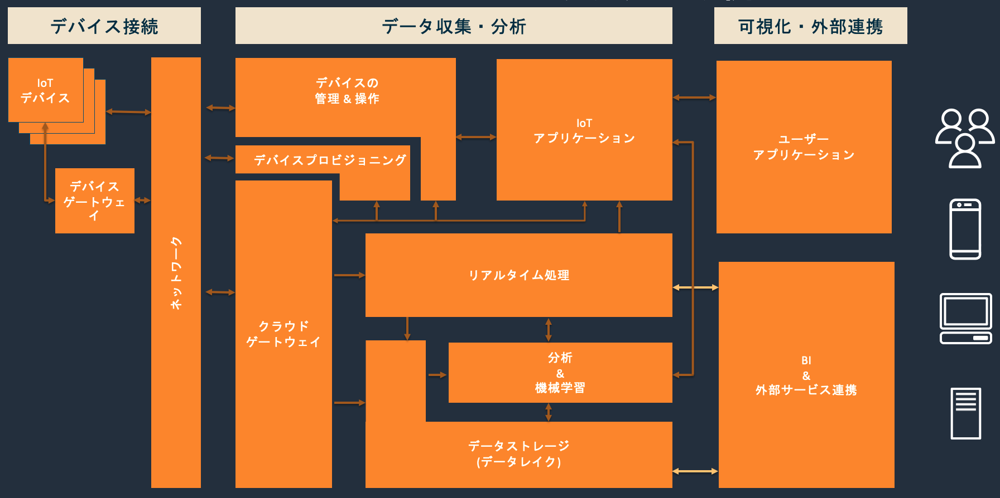

# IoT Solution Samples

## IoT Solution Sampleとは？

IoTの分野は「総合格闘技」と呼ばれるほど、ハードウェア・通信・サーバーなど必要な技術分野が多岐にわたり、ビジネスモデルが複雑で全体を理解するのが難しいことが課題として挙げられます。単純にIoT関連のサービスを導入すれば解決するというわけではなく、活用方法の工夫や複数サービスを組み合わせ試行錯誤する必要が出てきます。

さまざまなIoTのユースケースを対応してきた経験から、IoTのユースケースでは以下の図の様な要素が登場してくると思います(全てのユースケースで、ここにあげている要素が全て必要というわけではなく、サービスのフェーズや状況によっては、一部の機能だけを導入することはよくあります)。

このリポジトリでは、このアーキテクチャの中に登場する機能の参考になるリソースやサンプルコードについて紹介しています。

### デバイス接続

- IoTデバイス
  - [AWS IoT Device Client(サンプルソース)](https://github.com/awslabs/aws-iot-device-client)
- デバイスゲートウェイ
  - [AWS IoT Greengrassとローカルデバイスの連携について(ブログ)](https://aws.amazon.com/jp/blogs/news/implementing-local-client-devices-with-aws-iot-greengrass/)
  - [製造装置データ収集の選択肢(スライド)](https://pages.awscloud.com/rs/112-TZM-766/images/EV_aws-iot-deep-dive-5-915-topic2_Sep-2021.pdf)
- ネットワーク
  - [Disaster Recovery for AWS IoT(サンプルソース)](https://aws.amazon.com/jp/solutions/implementations/disaster-recovery-for-aws-iot/)
  - [AWS IoT Coreをオンプレミス環境よ使う際のアーキテクチャ例(スライド)](https://pages.awscloud.com/rs/112-TZM-766/images/EV_aws-iot-deep-dive-5-915-topic3_Sep-2021.pdf)

### データ収集・分析

- クラウドゲートウェイ
  - [AWS IoT Core のカスタムドメインを利用してコネクテッドデバイスを AWS に移行する(ブログ)](https://aws.amazon.com/jp/blogs/news/migrating-devices-aws-iot-custom-domains/)
- デバイスプロビジョニング
  - [AWS IoTにおけるデバイスへの認証情報のプロビジョニング(スライド)](https://pages.awscloud.com/rs/112-TZM-766/images/EV_iot-deepdive-aws2_Sep-2020.pdf)
- デバイス管理＆操作
  - [画角制御機能付きのセキュリティカメラを作ってみた(サンプルソース)](https://aws.amazon.com/jp/builders-flash/202109/angle-control-camera/)
  - [リアルタイムにセンサーデータを表示しデバイス操作可能な IoT アプリを作る(サンプルソース)](https://aws.amazon.com/jp/builders-flash/202103/m5sticc-remote-control/)
- IoTアプリケーション
  - [自分だけ開ける「スマート宝箱」を作って、大事なモノをセキュアに保管してみた(サンプルソース)](https://aws.amazon.com/jp/builders-flash/202101/smart-treasure-box/)

### 可視化・外部連携

- BI & 外部サービス連携
  - [AWS IoT を駆使してペットの気持ちを理解する(サンプルソース)](https://aws.amazon.com/jp/builders-flash/202105/smart-pet-communication/)
  - [スマートライフを実現 ! 家電製品をクラウドでコントロールしてみた(サンプルソース)](https://aws.amazon.com/jp/builders-flash/202102/control-smart-home-appliance/)
  - [AWS IoT でスマートホームを自作する 〜ドアフォン編〜(サンプルソース)](https://aws.amazon.com/jp/builders-flash/202004/smart-home/)
- 分析＆機械学習
  - [Jetson Nano と AWS IoT サービスで 一家団欒の時間を作ろう(サンプルソース)](https://aws.amazon.com/jp/builders-flash/202009/iot-greengrass-family/)
- ユーザーアプリケーション
  - [Raspberry Pi で簡単おうちセキュリティカメラを 作ってみた(サンプルソース)](https://aws.amazon.com/jp/builders-flash/202010/raspi-security-camera/)

## Security

See [CONTRIBUTING](CONTRIBUTING.md#security-issue-notifications) for more information.

## License

This library is licensed under the MIT-0 License. See the LICENSE file.

